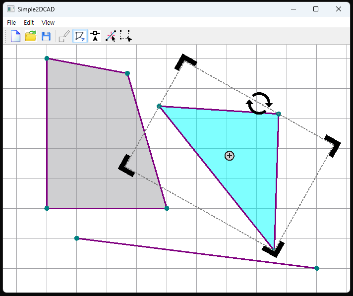
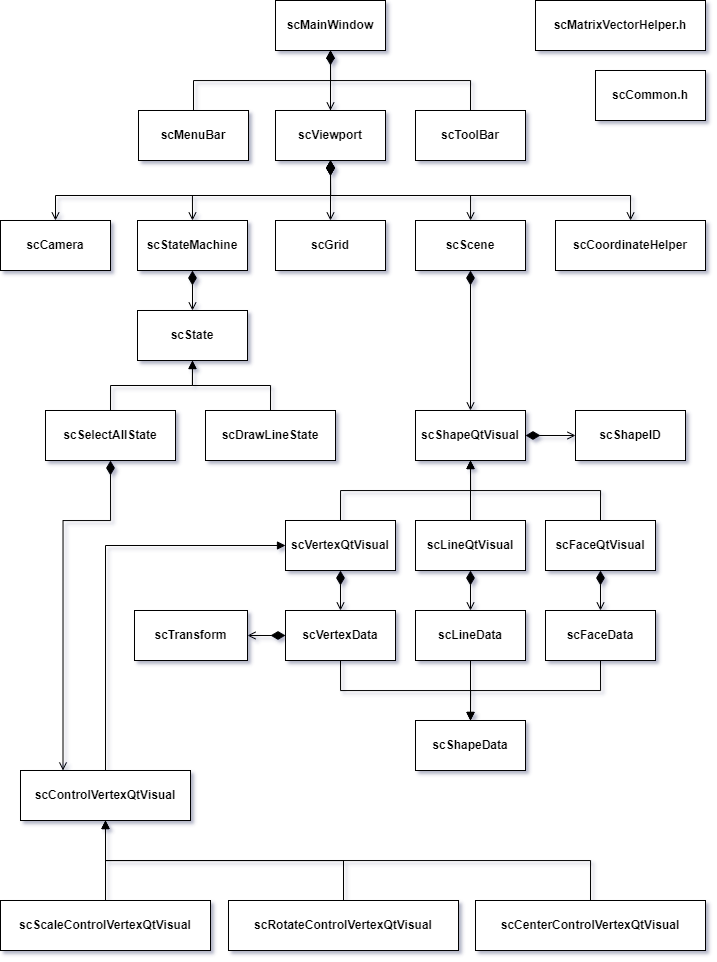

# Simple2DCAD

## Feature
### Draw
- Draw Shape(Vertex, Line, Face) using the mouse button.
- Snap Vertex and Grid when drawing.

### Select
- Select Shape(Vertex, Line, Face) using the mouse button.
- Snap Vertex and Grid when selecting another Vertex.
- Draw BoundingBox when selecting Face.
- Select ControlVertex(Scale, Rotate, Center) and Transform Face.

### Camera
- Pan/Zoom using the mouse button.

### Scene
- Infinite Grid adjusted appropriately according to ZoomRaito.
- New/Open/Save Scene using Serialization.

## Video
https://github.com/jakelee-zemotion/Simple2DCAD/assets/152123750/974db5bd-cf40-46c9-be10-81bed44c0c3a

## Diagram

## Build
